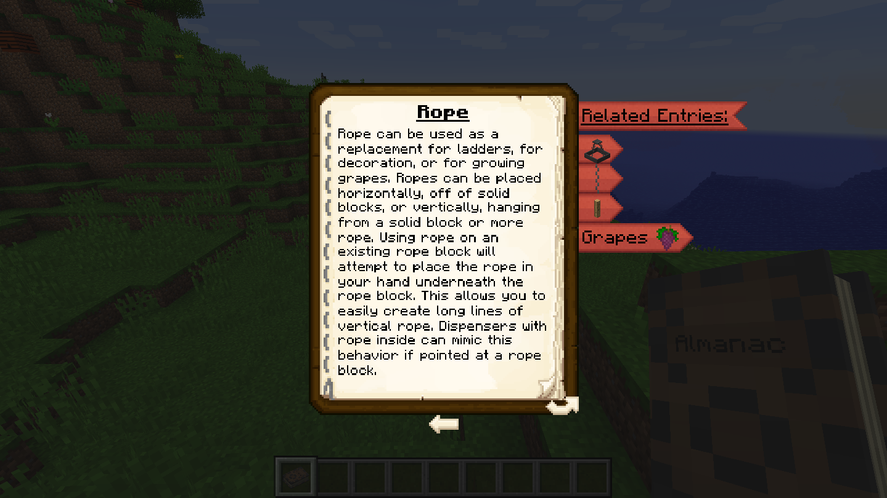

# Rustic 

### About the Mod
Rustic is a medieval themed Minecraft mod based around decoration, exploration, and agriculture. More information can be found on the [wiki](https://github.com/the-realest-stu/Rustic/wiki) or in-game (once you've installed the mod) in the Almanac, as shown below.

## Links
- [Wiki](https://github.com/the-realest-stu/Rustic/wiki)
- [Downloads](https://minecraft.curseforge.com/projects/rustic/files)
